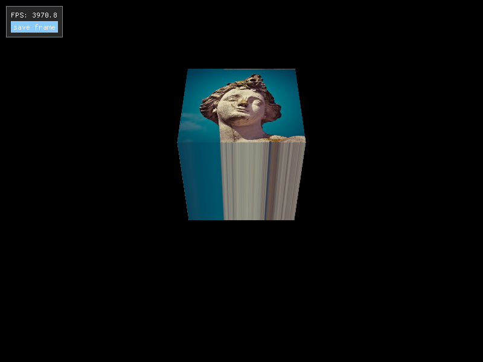

## Simulphy

The goal right now is to learn GPU based computer graphics using Vulkan API.

I intend to hack it into being a visual physics sandbox.

## Rendered Scenes

### Textured Cube


## Dependencies

Install following packages:

SDL2 (for windowing and framebuffer):

```sudo apt install libsdl2-dev```

Vulkan SDK:

Download the VulkanSDK tarball from [LunarG](https://vulkan.lunarg.com/) and setup as following:

```
pushd vulkansdk
tar -xf vulkansdk-linux-x86_64-1.4.304.1.tar.xz
ln -s 1.4.304.1 default
```
And then add the following to the system path (`~/.bashrc` or `~/.zshrc`):
```
source ~/path-to-vulkansdk-symbolic-link/default/setup-env.sh
```

## Build
```
cmake -B build && \
cmake --build build && \
./build/bin/BeLightVulkan
```
or

```
./build.sh
```
